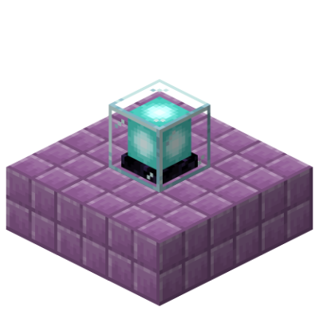

# Vanilla Multiblock API

[>> Downloads <<](https://github.com/CottonMC/VMulti/releases)

*Better buildings*

**This mod is open source and under a permissive license.** As such, it can be included in any modpack on any platform without prior permission. We appreciate hearing about people using our mods, but you do not need to ask to use them. See the [LICENSE file](LICENSE) for more details.

Vanilla Multiblock API, or VMulti, adds support for new elements of beacon, conduit, and enchanting table multiblocks.
